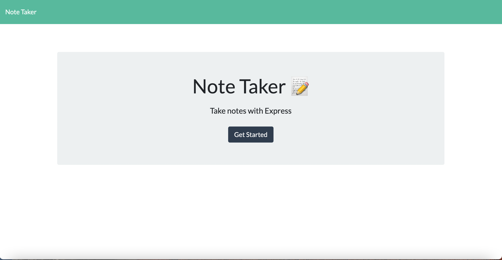
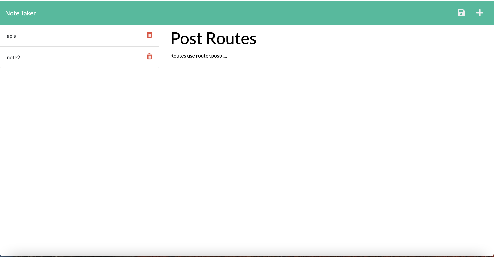
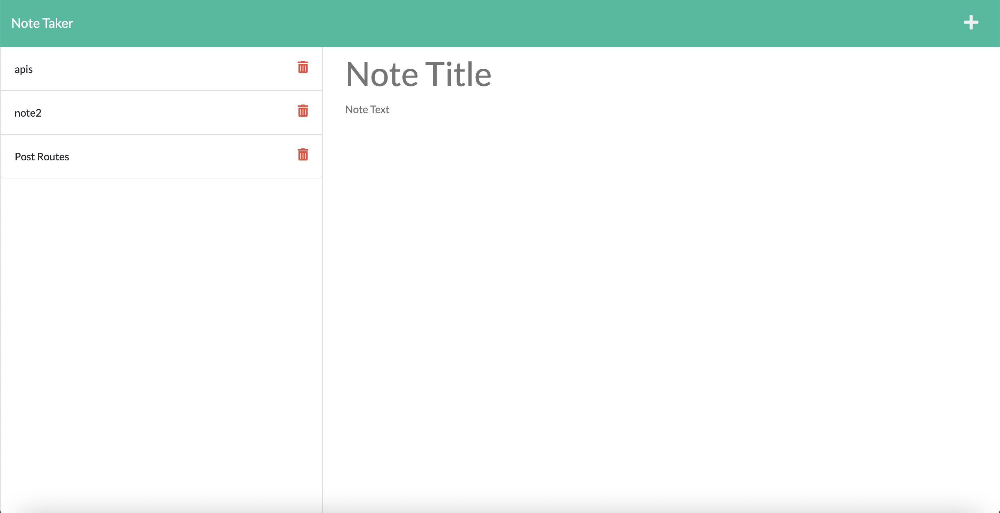

# Note Taker Starter Code

## Description
This note taker app allows user to create notes and save them. The user first 
names the note and will then enter notes into the other input field. 

The project required us to make the back-end function by creating five main server routes.
The two html routes retreive the main page and the notes page of the application. The other 
routes retreive, post and delete the notes from the db.json file or to the page. Those routes have been 
established so now, users may use the app without errors. 

## Screenshots
 "Homepage")
 "Adding note")
 "Note added")

## Links 
Deployed Application: https://algmoreno.github.io/note-taker/
Github: https://github.com/algmoreno/note-taker 
